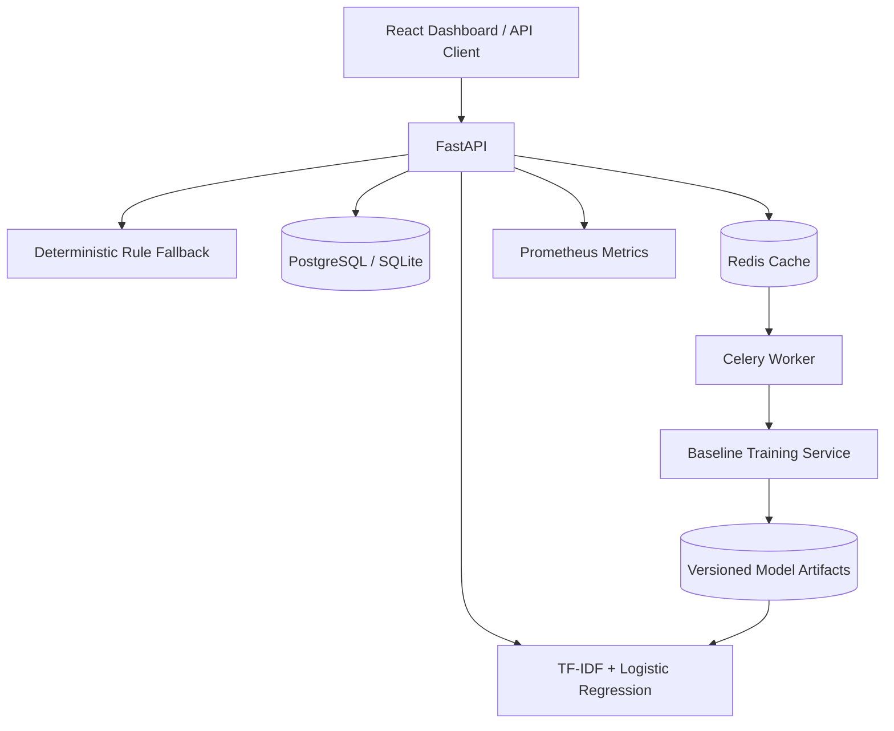

# Architecture and System Design

## Prediction path

1. The API validates the incoming subject and description.
2. The model manager reloads newly written artifacts when `metadata.json` changes.
3. When artifacts exist, TF-IDF features are passed to Logistic Regression.
4. The highest class probability becomes `confidence_score`.
5. `uncertainty_score` is calculated as `1 - confidence_score`.
6. Inputs above the configured uncertainty threshold are sent to the review queue.
7. If artifacts are missing, a deterministic rule fallback is used and identified in telemetry.

## Training path

The training service reads a CSV with `subject`, `description`, and `team` columns, creates a stratified train/validation split, trains the baseline, calculates accuracy and macro-F1, and atomically replaces the model artifacts.

The project does not claim that logged reviewer feedback is automatically safe training data. Corrections should be reviewed and merged into a curated dataset first.
