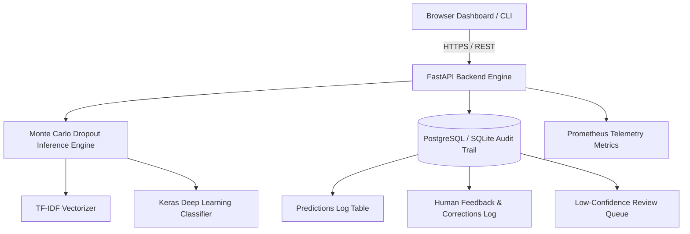

# Bug Report Classifier — SaaS Architecture & System Design

The **Bug Report Classifier Platform** transforms an NLP research model (TF-IDF + Monte Carlo Dropout) into an enterprise-grade SaaS platform.

## 🧠 Core ML Engine & Uncertainty Scoring

1. **TF-IDF Feature Extraction**: Converts raw text descriptions & subjects into 500-dimensional term-frequency vectors.
2. **Monte Carlo Dropout (MC Dropout)**:
   - Executes $N=20$ to $N=100$ stochastic forward passes with dropout enabled at test time.
   - Computes the mean probability vector across trials for the predicted backlog team.
   - Standard Deviation ($\sigma$) serves as an empirical proxy for prediction uncertainty.
3. **Tri-Tier Confidence Classification**:
   - **HIGH** ($\sigma < 0.05$): Auto-assigned to target engineering backlog.
   - **MEDIUM** ($0.05 \le \sigma < 0.15$): Suggested with top 3 alternatives.
   - **LOW** ($\sigma \ge 0.15$): Routed to Human Review Queue.
